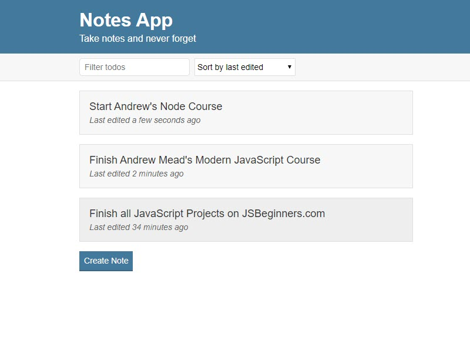

# Exercícios DOM

1. Utilizando o HTML da Teórica, altere o `background-color` da tag `main` para
   `yellow`, ao fim de 1s.

2. Utilizando o HTML da Teórica, altere a `color` do `input` com id _name_ para
   `red`, ao fim de 1s.

3. Utilizando o HTML da Teórica, altere o `footer` para substituir o
   _"YourName"_ com o vosso nome, ao fim de 1s.

4. Utilizando o HTML da Teórica, altere o `href` do `a` do primeiro "card" para
   `https://google.com`, ao fim de 1s.

5. Utilizando o HTML da Teórica, altere o `href` do `a` do terceiro "card" para
   `https://facebook.com`, ao fim de 1s.

6. Utilizando o HTML da Teórica, altere o `href` do `a` do último "card" para
   `https://brenosalles.com`, ao fim de 1s.

7. Utilizando o HTML da Teórica, altere o `type` para `number` do `input` com
   id _subject_, ao fim de 1s.

8. Utilizando o HTML da Teórica, elimine o penúltimo "card", ao fim de 1s.

9. Utilizando o HTML da Teórica, altere o segundo "card" para qualquer coisa
   que quiser, ao fim de 1s.

10. Utilizando o HTML da Teórica, altere a classe `btn-outline-danger` para
    `btn-danger` do `button` que contem o texto _"Reset"_.

11. Fazer um simples jogo de pedra, papel ou tesoura, seguindo a imagem seguinte.
    

12. Fazer o jogo da forca, recorrendo a algumas palavra pré-definidas.
    

13. Criar um jogo do cara ou coroa, em que o jogador escolhe a sua opção e o
    computador fica com a que sobra.
    

14. Criar uma um programa que diga "Bom dia", "Boa tarde" ou "Boa noite", com
    base na hora atual.
    

15. Criar um formulário que, com base no tamanho em _feet_ e _inches_ converta
    para _cm_.
    

16. Criar um programa que, ao clicar numa lâmpada, esta se acenda.
    

17. Criar um programa que mostre a contagem decrescente de um relógio até ao
    dia de Natal.
    

18. Crie o jogo do alto e do baixo. O utilizador insere um número e tem 10
    tentativas para acertar um número aleatório.
    

19. Crie um formulário que em que o utilizador insira o resultado da soma entre 2 números aleatórios, gerados a cada refresh da página.
    

20. Crie um programa que ao clicar num botão, altere a `background-color` de
    uma `div`.
    

21. Crie um programa que mostre o dia da semana atual.
    

22. Crie um programa que aumente ou diminua a contagem de um valor presente
    numa `div`.
    

23. Crie um programa que calcule e mostre o tamanho de uma string inserida pelo
    utilizador.
    

24. Crie um programa que calcule o total de uma conta depois de inseridos os
    valores de calculo.
    

25. Crie um programa que calcule o IMC com base na altura e peso inseridos.
    

26. Crie um formulário de registo e que faça algumas validações básicas do
    registo do mesmo.
    

27. Crie um programa que altere o `background-color` de uma página com base no
    botão escolhido pelo utilizador.
    

28. Criar uma lista de notas que em que se possa adicionar novos elementos.
    

29. Criar uma lista de tarefas, em que se possa adicionar e remover elementos.
    

30. Criar uma lista de compras, em que se possa adicionar e remover elementos
    
